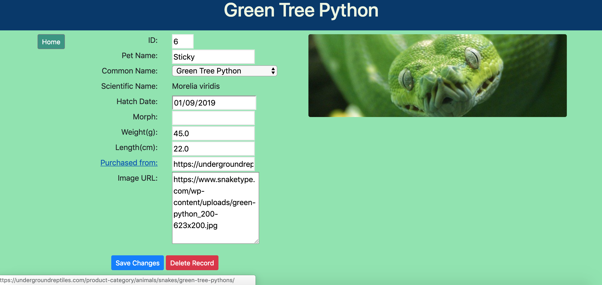

## Spring Boot/JPA CRUD Project
This Week 8 [Skill Distillery](http://skilldistillery.com) weekend project simulates a snake tracking database/site.

Users utilize the app's GUI to search through a pre-existing sample database that contains about a dozen sample snakes.  Record searches are made by ID or via dropdowns and will take users to a new page where additional details can be found.

Users can also:
- Add a new snake to the database
- Delete a snake from the database
- Save changes to a snake

### Topics/Technologies
- Spring Boot MVC
  - JavaServer Pages (JSPs), Java Standard Tag Library (JSTL), Java Persistence Query Language (JPQL), Post/Redirect/Get (PRG)
- SQL/mySQL
  - ManyToOne (An additional 'Species' table contains default images)
- Gradle (Build/Dependency Management)
- Bootstrap (Front-End)

